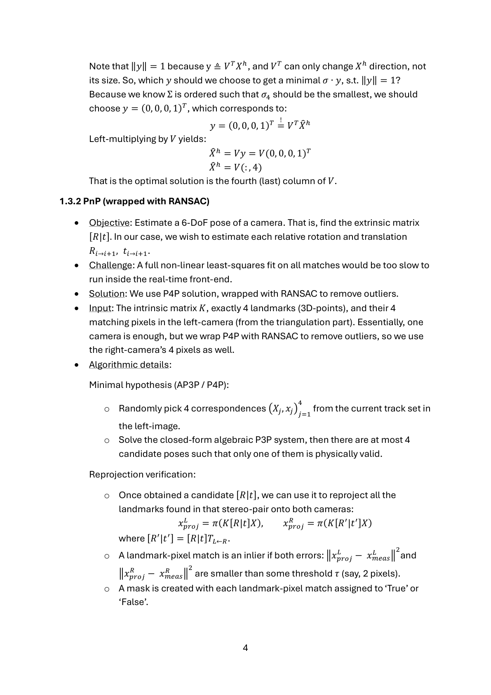

# SLAM: Final Project

**Name:** Guy Shmueli  
**I.D:** 208934273  
**GitHub URL:** <https://github.com/GuyShmueli/SLAM>  
**Note:** The code is split into classes found in the `slam` directory.  

---

## Table of Contents
- [1. Introduction and Overview](#1-introduction-and-overview)
  - [1.1 Background](#11-background)
  - [1.2 Importance](#12-importance)
  - [1.3 Algorithms](#13-algorithms)
    - [1.3.1 Triangulation](#131-triangulation)
    - [1.3.2 PnP (wrapped with RANSAC)](#132-pnp-wrapped-with-ransac)
    - [1.3.3 Bundle-Adjustment](#133-bundle-adjustment)
    - [1.3.4 Loop-Closure](#134-loop-closure)
- [2. Code](#2-code)
- [3. Performance Analysis](#3-performance-analysis)
  - [3.1 Tracking Statistics](#31-tracking-statistics)
  - [3.2 Tracking Plots](#32-tracking-plots)
  - [3.3 PnP, BA and LC Comparison Plots](#33-pnp-ba-and-lc-comparison-plots)
  - [3.4 BA-specific Plots](#34-ba-specific-plots)
  - [3.5 LC-specific Plots](#35-lc-specific-plots)
  - [3.6 The Trajectory](#36-the-trajectory)
- [4. Extra – SuperPoint and SuperGlue](#4-extra-superpoint-and-superglue)
- [Appendix: Full PDF Page Snapshots](#appendix-full-pdf-page-snapshots)

---

## 1. Introduction and Overview

### 1.1 Background
SLAM (“Simultaneous Localization and Mapping”) is the core perception task designated to simultaneously estimate the robot’s trajectory (localization) and reconstruct landmarks in its environment (mapping), real-time speaking. In a stereo-vision setting, the robot receives two synchronized images at each time-step and must:
- Estimate its 6 Degree-of-Freedom (DoF) pose, relative to an arbitrary world frame.
- Reconstruct a 3D representation of the landmarks.

### 1.2 Importance
SLAM is important because, nowadays, robots are involved everywhere. It enables the robot to operate and navigate when a higher precision than achieved by GPS is needed.  
Some concrete examples:
- **Transportation domain:** Autonomous vehicles require a much lower frame-to-frame (relative) error than the one introduced by GPS, which can be ~1 meters. SLAM provides ~10^−2 and even ~10^−3 meters frame-to-frame error.
- **Medical domain:** Surgical robots employ SLAM inside the human body.
- **Military domain:** Drones can use SLAM in GPS-denied arenas (e.g., indoor).
- **Entertainment domain:** AR headsets embed SLAM pipelines so virtual objects stay rigidly anchored to the physical world.

### 1.3 Algorithms

#### 1.3.1 Triangulation
- **Objective:** Reconstruct a 3D point \(X=(p_x, p_y, p_z)^\top\) corresponding to a pixel \(\mathbf{x} = (u, v)^T\) in an image.
- **Challenge:** According to projective geometry, a pixel from a single image can be mapped into a ray, not to a single point.
- **Solution:** We use a rectified stereo-pair, so we can compute \(p_z\) while also maintaining geometric inliers by using \(v_L = v_R\) validation.
- **Input:** 2 pixels \(\mathbf{x}_L, \mathbf{x}_R\) representing the same landmark in a stereo-camera alongside their camera matrix.
- **Algorithmic details:** We use homogenous triangulation, so we work in projective-coordinates:  
  \(\mathbf{X} \rightarrow \mathbf{X}_h = (p_x, p_y, p_z, 1)^T\), \(\mathbf{x} \rightarrow \mathbf{x}_h = (u, v, 1)^T\).  
  According to the camera-projection equation:
  \[\lambda_i\,\mathbf{x}^{(h)}_i = \mathbf{P}_i\,\mathbf{X}^{(h)},\quad \mathbf{P}_i = \mathbf{K}[\mathbf{R}_i|\mathbf{t}_i],\ i\in\{1,2\}\]
  where \(i\) represents either the left or right camera, \(\mathbf{P}_i\) is the corresponding camera matrix, and \(\lambda_i\) is the unknown depth-scale introduced by projective geometry.

  Hence, the camera-projection equation tells us that, in ideal scenario, \(\mathbf{x}^{(h)}_i\) and \(\mathbf{P}_i\mathbf{X}^{(h)}\) vectors are parallel. We can utilize the fact that parallel vectors have a 0-vector cross-product:
  \[\mathbf{x}^{(h)}_i \times (\mathbf{P}_i\mathbf{X}^{(h)}) = \mathbf{0}\]

  Which yields us 2 equations for the left camera, and 2 equations for the right one. We can assemble them in a compact \(4\times4\) linear homogenous system:
  \[
  \mathbf{A}_h =
  \begin{pmatrix}
  u_1\,\mathbf{P}_{13}^T - \mathbf{P}_{11}^T \\
  v_1\,\mathbf{P}_{13}^T - \mathbf{P}_{12}^T \\
  u_2\,\mathbf{P}_{23}^T - \mathbf{P}_{21}^T \\
  v_2\,\mathbf{P}_{23}^T - \mathbf{P}_{22}^T
  \end{pmatrix}_{4\times4},
  \qquad
  \mathbf{A}_h\,\mathbf{X}^{(h)} = \mathbf{0}.\]

  Where \(\mathbf{X}^{(h)}\) is exactly what we’re trying to find. The problem is that the right and left camera won’t agree with one another exactly due to real-life noise. We can do least-squares to settle that. It gives us the optimal parameters \(\hat{\mathbf{X}}^{(h)}\):
  \[\hat{\mathbf{X}}^{(h)} = \arg\min_{\|\mathbf{X}^{(h)}\|=1} \|\mathbf{A}_h\,\mathbf{X}^{(h)}\|_2.\]

  We can now do an SVD-decomposition to \(\mathbf{A}_h\): \(\mathbf{A}_h = \mathbf{U}\,\boldsymbol{\Sigma}\,\mathbf{V}^T\), where \(\boldsymbol{\Sigma}=\operatorname{diag}(\sigma_1\ge\sigma_2\ge\sigma_3\ge\sigma_4)\).  
  So \(\mathbf{A}_h\,\mathbf{X}^{(h)}\) is equivalent to:
  \[\mathbf{A}_h\,\mathbf{X}^{(h)} = \mathbf{U}\,\boldsymbol{\Sigma}\,\mathbf{V}^T\,\mathbf{X}^{(h)} = \mathbf{U}\,\boldsymbol{\Sigma}\,\mathbf{y} = \mathbf{U}\,(\sigma_1y_1,\sigma_2y_2,\sigma_3y_3,\sigma_4y_4)^T,\]
  where we annotated \(\mathbf{y} \equiv \mathbf{V}^T\,\mathbf{X}^{(h)}\). Now we can compute:
  \[(\mathbf{A}_h\,\mathbf{X}^{(h)})^T(\mathbf{A}_h\,\mathbf{X}^{(h)}) = (\sigma_1y_1,\sigma_2y_2,\sigma_3y_3,\sigma_4y_4)^T(\sigma_1y_1,\sigma_2y_2,\sigma_3y_3,\sigma_4y_4) = \sum_{k=1}^4 \sigma_k^2 y_k^2.\]

  So our equivalent least-squares to solve is:
  \[\hat{\mathbf{X}}^{(h)} = \arg\min_{\|\mathbf{y}\|=1} (\boldsymbol{\sigma}\cdot\mathbf{y}).\]

  Note that \(\|\mathbf{y}\| = 1\) because \(\mathbf{y} = \mathbf{V}^T\,\mathbf{X}^{(h)}\), and \(\mathbf{V}^T\) can only change the direction, not the size. Because \(\boldsymbol{\Sigma}\) is ordered such that \(\sigma_4\) is the smallest, we choose \(\mathbf{y}=(0,0,0,1)^T = \mathbf{V}^T\hat{\mathbf{X}}^{(h)}\). Left-multiplying by \(\mathbf{V}\) yields:
  \[\hat{\mathbf{X}}^{(h)} = \mathbf{V}\,(0,0,0,1)^T = \mathbf{V}(:,4).\]
  That is, the optimal solution is the fourth (last) column of \(\mathbf{V}\).

#### 1.3.2 PnP (wrapped with RANSAC)
- **Objective:** Estimate a 6-DoF pose of a camera. That is, find the extrinsic matrix \([\mathbf{R}|\mathbf{t}]\). In our case, we wish to estimate each relative rotation and translation \(\mathbf{R}_{i\to i+1}, \mathbf{t}_{i\to i+1}\).
- **Challenge:** A full non-linear least-squares fit on all matches would be too slow to run inside the real-time front-end.
- **Solution:** We use P4P solution, wrapped with RANSAC to remove outliers.
- **Input:** The intrinsic matrix \(\mathbf{K}\), exactly 4 landmarks (3D-points), and their 4 matching pixels in the left-camera (from the triangulation part). Essentially, one camera is enough, but we wrap P4P with RANSAC to remove outliers, so we use the right-camera’s 4 pixels as well.
- **Algorithmic details:**  
  **Minimal hypothesis (AP3P / P4P):**
  1. Randomly pick 4 correspondences \((\mathbf{X}_j, \mathbf{x}_j))\) from the current track set in the left-image.
  2. Solve the closed-form algebraic P3P system, then there are at most 4 candidate poses such that only one of them is physically valid.

  **Reprojection verification:**  
  Once obtained a candidate \([\mathbf{R}|\mathbf{t}]\), we can use it to reproject all the landmarks found in that stereo-pair onto both cameras:
  \[\mathbf{x}^{\text{proj}}_L = \pi(\mathbf{K}[\mathbf{R}|\mathbf{t}]\,\mathbf{X}),\qquad \mathbf{x}^{\text{proj}}_R = \pi(\mathbf{K}[\mathbf{R'}|\mathbf{t'}] \mathbf{X}),\]
  where \([\mathbf{R'}|\mathbf{t'}] = [\mathbf{R}|\mathbf{t}]\,\mathbf{T}_{L\leftarrow R}.\)  
  A landmark–pixel match is an inlier if both errors \(\|\mathbf{x}^{\text{proj}}_L-\mathbf{x}^{\text{meas}}_L\|_2\) and \(\|\mathbf{x}^{\text{proj}}_R-\mathbf{x}^{\text{meas}}_R\|_2\) are smaller than some threshold \(\tau\) (say, 2 pixels). A mask is created with each landmark–pixel match assigned to `True` or `False`.

  If another subset of 4 landmarks yields more inliers (bigger mask sum), the best mask is updated.

  **Adaptive RANSAC iteration count:**  
  Denoting \(w\) as the inlier-ratio (\(\#\text{inliers}/\#\text{landmarks}\)), \(m\) as the sample size (\(m=4\)) and \(N\) as the number of iterations we repeat that loop. The probability the whole sample is pure inliers is \(P_{\text{good}} = w^m\), hence the probability for it to be bad (at least one outlier) is \(P_{\text{bad}}=1-w^m\). The probability that all \(N\) iterations yield at least one outlier each time is \(P_{\text{all iterations bad}}=(1-w^m)^N\). We want to find \(p\) such that
  \[p \ge 1-(1-w^m)^N\,\Rightarrow\,N_{\text{req}} = \frac{\log(1-p)}{\log(1-w^m)}.\]

  **Pose refinement:**  
  Run one Gauss–Newton / `cv2.SOLVEPNP_ITERATIVE` on the final inlier set to minimize true reprojection error in the left image.

#### 1.3.3 Bundle-Adjustment
- **Triangulation** is considered *1-point, multi-view.* It tries to answer: *Given a multi-view perception, where should the landmark be mapped so reprojecting it will yield the best agreement by its corresponding measured pixels in all frames (in our case 2 frames)?* Note that the cameras’ poses are fixed; only the location of the landmark can be moved.
- **PnP** is considered *1-view, multi-point.* It tries to answer: *Given many points in a single frame and their corresponding landmarks, where should the camera be located so reprojecting all these landmarks will yield the best agreement by their corresponding measured pixels in that frame?* Note that the landmarks’ locations are fixed; only the cameras’ poses can be moved.
- **Bundle-Adjustment** incorporates both ideas simultaneously. Neither landmarks’ locations, nor cameras’ poses are fixed. Both can be moved to satisfy the following non-linear least-squares problem:
  \[
  \{\hat{\mathbf{R}}^L_i,\hat{\mathbf{t}}^L_i,\hat{\mathbf{R}}^R_i,\hat{\mathbf{t}}^R_i\}_{i=1}^T,\;\{\hat{\mathbf{X}}_j\}_{j=1}^M
  = \arg\min_{\{\mathbf{R}_i,\mathbf{t}_i\},\{\mathbf{X}_j\}}
  \sum_{i=1}^T\sum_{j=1}^{N_i}\big\|\mathbf{x}^L_{i,j} - \pi(\mathbf{K}[\mathbf{R}^L_i|\mathbf{t}^L_i]\mathbf{X}_j)\big\|_2^2
  + \big\|\mathbf{x}^R_{i,j} - \pi(\mathbf{K}[\mathbf{R}^R_i|\mathbf{t}^R_i]\mathbf{X}_j)\big\|_2^2\,.
  \]

- **Deterministic vs Probabilistic SLAM:**  
  Deterministic SLAM has a prominent disadvantage. Assuming we have a measurement \(z_{ij}\) and 2 projections \(\pi_1, \pi_2\). If these two projections lie, for example, on the same circle around \(z_{ij}\), the deterministic approach would say they are similarly probable (as in \(L_2\)-norm). If we use a probabilistic approach instead, it will give us extra information. If we know the covariance matrix, then we can see, for example, that \(\pi_2\) is within a smaller Mahalanobis distance, hence more probable.

- **Probabilistic SLAM cost derivation:**  
  We can model the measured pixel \(z_{ij}\) (which was detected by SIFT-like algorithms), by reprojecting its corresponding landmark \(\mathbf{X}_j\) onto camera \(c_i\) and add a Gaussian noise \(\varepsilon_{ij}\):
  \[z_{ij} = \pi(c_i, \mathbf{X}_j) + \varepsilon_{ij}, \qquad \varepsilon_{ij} \sim \mathcal{N}(0, \boldsymbol{\Sigma}_{ij}).\]
  Practically, \(\boldsymbol{\Sigma}_{ij}\) is usually shared across all measurements, \(\boldsymbol{\Sigma}_{ij}\equiv\boldsymbol{\Sigma}\).
  That is, we know the conditional probability \(P(z_{ij}|c_i,\mathbf{X}_j) \sim \mathcal{N}(\pi(c_i,\mathbf{X}_j),\boldsymbol{\Sigma})\). However, we need the case where we have \(z_{ij}\) and wish to model \(c_i, \mathbf{X}_j\), which is \(P(c_i, \mathbf{X}_j|z_{ij})\). By Bayes rule:
  \[P(c_i,\mathbf{X}_j|z_{ij}) = \frac{1}{P(z_{ij})} P(z_{ij}|c_i,\mathbf{X}_j)P(c_i,\mathbf{X}_j).\]
  The case where we condition our parameters by the measurements (data) is called the *posterior*. We wish to find the parameters \(c_i, \mathbf{X}_j\) that maximize it (MAP). Noticing that \(P(z_{ij})\) does not depend on the parameters, we can drop it and use \(\propto\) instead of equality:
  \[P(c_i,\mathbf{X}_j|z_{ij}) \propto P(z_{ij}|c_i,\mathbf{X}_j) P(c_i,\mathbf{X}_j).\]
  We can now either do Maximum-Likelihood (drop the prior) or MAP estimation. For **MLE**:
  \[\{\hat{c}_i\},\{\hat{\mathbf{X}}_j\} = \arg\max_{\{c_i\},\{\mathbf{X}_j\}} \prod_{i,j} P(z_{ij}|c_i,\mathbf{X}_j).\]
  Writing it as log-likelihood yields:
  \[\{\hat{c}_i\},\{\hat{\mathbf{X}}_j\} = \arg\min_{\{c_i\},\{\mathbf{X}_j\}}\ \frac{1}{2}\sum_{i,j}\|\Delta z_{ij}\|^2_{\boldsymbol{\Sigma}_{ij}},\]
  where \(\Delta z_{ij} \equiv z_{ij} - \pi(c_i, \mathbf{X}_j) = \varepsilon_{ij}\) and \(\|\Delta z_{ij}\|^2_{\boldsymbol{\Sigma}} = \Delta z_{ij}^T\boldsymbol{\Sigma}^{-1}\Delta z_{ij}\).  
  The deterministic approach can be achieved by choosing \(\boldsymbol{\Sigma}\) to be the 2×2 identity matrix; the probabilistic approach is more general.

  For **MAP**, set a prior (anchor) on the first pose (usually anchoring \(\mathbf{X}_0\) is not needed):  
  \(c_0 \sim \mathcal{N}(\bar{c}_0,\boldsymbol{\Sigma}_{c_0})\) and
  \[-\log P(c_0) = \tfrac{1}{2}\|c_0-\bar{c}_0\|^2_{\boldsymbol{\Sigma}_{c_0}}.\]
  Performing the same process as in MLE yields:
  \[J_{\text{MAP}} = \tfrac{1}{2}\sum_{i,j}\|\Delta z_{ij}\|^2_{\boldsymbol{\Sigma}} + \tfrac{1}{2}\|c_0-\bar{c}_0\|^2_{\boldsymbol{\Sigma}_{c_0}} = J_{\text{MLE}} + \tfrac{1}{2}\|c_0-\bar{c}_0\|^2_{\boldsymbol{\Sigma}_{c_0}}.\]

  In order to convert the Mahalanobis-norm into \(L_2\)-norm, a process called **whitening** is performed:
  \[\|\Delta z_{ij}\|^2_{\boldsymbol{\Sigma}} = (\boldsymbol{\Sigma}^{-1/2}\,\Delta z_{ij})^T(\boldsymbol{\Sigma}^{-1/2}\,\Delta z_{ij}) \equiv \mathbf{r}_{ij}^T\mathbf{r}_{ij} = \|\mathbf{r}_{ij}\|_2^2.\]

- **Optimization:** BA is a non-linear least-squares problem, solved by iterative optimization (Gradient Descent, Gauss–Newton, Levenberg–Marquardt). Our objective is to approach the cost function’s minimum (preferably global, but could be local).
  - In **GD** we move in small steps towards the opposite direction of the gradient:
    \[\mathbf{x}^{(t+1)} = \mathbf{x}^{(t)} - \alpha\,\nabla f(\mathbf{x}^{(t)}).\]
    Advantage: only first derivatives → faster to compute. Disadvantage: converges only once it arrives near a flat region → may take a long time.
  - In **Gauss–Newton** we linearize the residuals:
    \[\mathbf{r}(\mathbf{x}^{(t+1)}) \approx \mathbf{r}(\mathbf{x}^{(t)}) + \mathbf{J}\,\Delta\mathbf{x},\quad \mathbf{J}=\tfrac{\partial\mathbf{r}}{\partial \mathbf{x}}\Bigr|_{\mathbf{x}^{(t)}}\ (2\times9).\]
    Plugging into \(F(\Delta\mathbf{x}) = \tfrac{1}{2}\|\mathbf{r}(\mathbf{x}^{(t+1)})\|^2_{\boldsymbol{\Sigma}}\) and simplifying with the orthonormality of \(\mathbf{U}\) yields the normal equations:
    \[\mathbf{H}^{(t)}\,\Delta\mathbf{x}^{(t)} = \mathbf{g}^{(t)},\quad \mathbf{H}=\mathbf{J}^T\boldsymbol{\Sigma}^{-1}\mathbf{J},\quad \mathbf{g}=-\mathbf{J}^T\boldsymbol{\Sigma}^{-1}\mathbf{r}(\mathbf{x}^{(t)}).\]
    (GTSAM utilizes sparsity, e.g., via Cholesky of \(\mathbf{H}\).) Advantage: faster convergence; disadvantage: requires second-derivative structure.
  - **Levenberg–Marquardt** integrates both: far from the minimum, acts like GD; near the minimum, like Gauss–Newton (this is the approach used here).
- **Gauge freedom:** Due to having only relative poses, we’re missing the global characterization of the trajectory. If we don’t set a prior (with high confidence), we will likely end up with an ill-posed problem.
- **Global vs Local BA:** Global optimizes all poses and landmarks in one shot, while local BA limits optimization to a sliding window of ~10–20 frames, which is more appropriate for real-time operation.

#### 1.3.4 Loop-Closure
- **Pose-Graph:** Because local BA refines only a sliding window of keyframes, older poses accumulate drift and lose global consistency. To re-align the entire trajectory in real-time, treat each keyframe pose as a node and the relative-pose constraints (odometry, local-BA priors, loop-closure edges) as a sparse pose graph. Running a fast non-linear optimisation on that graph periodically (or after every new key-frame) updates all poses at low cost, restoring global coherence while keeping the heavy global BA off the real-time path.
- **Loop-closure:** When the system recognizes that the current camera view corresponds to a previously visited place. The front-end confirms this by matching features (place recognition + RANSAC-PnP) and creates a loop-closure edge (a 6-DoF relative-pose constraint with its uncertainty). Passing that edge to the back-end lets the pose-graph optimizer redistribute accumulated drift over the whole trajectory, “closing the loop” and greatly reducing global error without needing global BA.

---

## 2. Code
The code is split into classes, found in sub-directories.

| Stage | File | Lines |
|---|---|---|
| Triangulation | `slam.frontend.geometry.triangulation` | — |
| RanSAC | `slam.frontend.geometry.pnp` | 102 |
| PnP | `slam.frontend.geometry.pnp` | — |
| Database definition | `slam.backend.tracking.database` | — |
| Adding a frame to the database | `slam.backend.tracking.fill_database` | 85 |
| Single Bundle creation | `slam.backend.optimizers.bundle_adjustment` | 126 |
| The relative transformation | `slam.backend.optimizers.loop_closure` | 266, 272 |
| PoseGraph building | `slam.backend.optimizers.loop_closure` | 252 |
| Loop closure detection | `slam.backend.optimizers.loop_closure` | 252 |

> **Figure (Page 9)**: Code structure table and loop-closure module references.  
> 

---

## 3. Performance Analysis
**Note:** I have implemented the code for all the plots, but the guidelines asked for substantial subset of them and restricted the project to 20 pages, so I didn’t present all the plots in the project.

### 3.1 Tracking Statistics
- Total number of tracks: **204,432**.
- Number of frames: **2,600**.
- Mean track length (frames): **5.48**.
- Mean number of frame links: **430.65**.

### 3.2 Tracking Plots

**Track Length Histogram**  
*Figure 3.2.1 – Longevity of feature tracks (detection + matching + linking) across the whole sequence. `slam.backend.tracking.database` line 552.*  
**What it shows:** To present the data in a meaningful way, the y-axis is logarithmic scaled due to the large ratio between #short tracks / #long tracks.  
**Reading the plot:** Most tracks are short with a long, thin tail out to ~50 frames. A handful of very long tracks exist, but the majority die within a few frames.  
**What it demonstrates:**  
- **Positive:** The system consistently generates many usable tracks. The presence of tracks of length 30–50 indicates pockets of highly stable features.  
- **Negative:** The dominance of short lifetimes implies frequent track breakage (viewpoint change, or aggressive filtering), which limits how many constraints survive into BA.  

**Per-Frame Connectivity**  
*Figure 3.2.2 – A connectivity graph presenting the number of tracks on the frame with links also in the next frame. The horizontal line is the mean. `slam.backend.tracking.database` line 568.*  
**What it shows:** For each frame *t*, the number of tracks that continue to frame *t+1*. This measures tracker stability and database linking quality frame-to-frame.  
**Reading the plot:** Values at around ~300–400 for long stretches, but with large fluctuations: dips near ~150–250 indicate hard segments (low texture, blur, large rotations), while peaks ~500–700 reflect very track-rich frames.  
**What it demonstrates:**  
- **Positive:** Sustained mid-high connectivity across most of the run, which yields enough constraints to propagate downstream to PnP/BA.  
- **Negative:** There are a few dips which demonstrate weaker constraints and more drift risk (or even ill-posed problem).

**Number of matches per Frame**  
*Figure 3.2.3 – Number of frame-to-frame matches before applying any geometrical outlier filtering. `slam.backend.tracking.fill_database` line 262.*

**Reading the plot:** Mean around ~550 (red baseline). Wide spread (~200–1000). There is a sustained drop (~150–350) that lines up with the connectivity dip in Figure 2, followed by recovery to high-match regions later in the sequence.  
**What it demonstrates:**  
- **Positive:** The system usually produces a high volume of matches, supporting stable RANSAC-PnP.  
- **Negative:** The slumps are bottlenecks, fewer reliable matches lead to fewer verified inliers, which lead to shakier poses.

**Percentage of PnP Inliers per Frame**  
*Figure 3.2.4 – PnP inlier percentage per frame. `slam.backend.tracking.fill_database` line 262.*  
**What it shows:** Geometric verification quality based on two tests: (I) Stereo condition (approximately the same image y-coordinate); (II) RANSAC-PnP.  
**Reading the plot:** The red baseline is ~65%. Most frames sit between 60–80%. The weakest region (~50%) aligns with the low-matches/low-connectivity segment.  
**What it demonstrates:**  
- **Positive:** A stable, high inlier rate over thousands of frames indicates good outlier rejection, and broadly consistent scene geometry.  
- **Negative:** Dips show where PnP gets less reliable, as in previous figures.

**PnP Reprojection Error vs. Distance from Reference**  
*Figure 3.2.5 – PnP reprojection error (L2 pixels) as a function of temporal distance from a reference frame (an arbitrary track of length 40 was chosen), plotted for the left/right cameras separately. `slam.analysis.pnp_plot` line 72.*  
**Reading the plot:** Error grows almost monotonically all along the track, for both cameras.  
**What it demonstrates:** Left/right cameras are consistent, and the monotonically increasing behavior is what I was expecting before applying any global optimizers.

### 3.3 PnP, BA and LC Comparison Plots

**PnP, BA and LC Absolute Position Error (with respect to KITTI’s ground-truth)**  
*Figure 3.3.1 – Per-frame absolute position error (in meters) after PnP (top), BA (middle) and LC (bottom), decomposed into x, y, z and Euclidean norm. The PnP function is in `slam.analysis.pnp_plot` line 91, while the BA/LC in `slam.analysis.optimizers_analysis` line 31.*

**What’s plotted & how it’s computed:**  
For each frame \(i\), compare the estimated camera center \(\mathbf{C}^{\text{est}}_i\) to the KITTI ground-truth center \(\mathbf{C}^{\text{gt}}_i\) in the world frame and report the component-wise absolute translation errors \(\|e_{x,i}\|, \|e_{y,i}\|, \|e_{z,i}\|\) and the Euclidean norm \(\|\mathbf{e}_i\|\), where \(\mathbf{e}_i = \mathbf{C}^{\text{est}}_i - \mathbf{C}^{\text{gt}}_i\) (meters).

**Observations & interpretation:**
- **PnP (top):** Errors grow with traveled distance as drift accumulates. The total position error norm peaks at ~60 m around frames ~2,000, dominated mainly by y-error.
- **BA (middle):** Windowed joint optimization reduces drift and smooths the per-axis errors. The peak norm drops to ~15 m (4× reduction vs. PnP), dominated mainly by z-error. The reason BA did manage to decrease dramatically the y-error, while decreasing more modestly the z-error is:
  \[u = \frac{f_x X}{Z} + c_x,\quad v = \frac{f_y Y}{Z} + c_y\]
  Small camera translations \(\delta\mathbf{t}=(\delta X,\delta Y,\delta Z)\) induce pixel shifts with such components in the Jacobian:
  \[\tfrac{\partial u}{\partial\delta X},\ \tfrac{\partial v}{\partial\delta Y} \propto \tfrac{1}{Z},\qquad
    \left|\tfrac{\partial u}{\partial\delta Z}\right|,\left|\tfrac{\partial v}{\partial\delta Z}\right| \propto \tfrac{1}{Z^2}.\]
  That’s why changing **z** reduces the cost much less efficiently than the same-sized change in **x** or **y**.
- **LC (bottom):** Adding loop-closure constraints anchors the trajectory globally and removes most accumulated drift. The error norm stays within a 0–5 m range across the entire run (~10× lower than PnP peaks, ~3× lower than BA peaks). Per-axis errors mostly lie below 2 m, with small oscillations after each closure as the pose-graph re-distributes corrections.

**PnP, BA and LC Absolute Rotation Error**  
*Figure 3.3.2 – Per-frame absolute orientation error after PnP, BA and LC. `slam.analysis.optimizers_analysis` line 90.*  
The orientation error is defined as the minimal rotation that aligns \(\mathbf{R}^{\text{est}}_k\) to \(\mathbf{R}^{\text{gt}}_k\), calculated as  
\[\phi_k = \arccos\left(\frac{\operatorname{tr}\big((\mathbf{R}^{\text{gt}}_k)^T\mathbf{R}^{\text{est}}_k\big)-1}{2}\right)\ [\deg].\]  
This metric is axis-agnostic (not yaw/pitch/roll separately). The behavior is similar to the Euclidean absolute position error.

**PnP, BA and LC Relative Position Error**  
*Figure 3.3.3 – Error of the relative translation between consecutive keyframes. `slam.analysis.optimizers_analysis` line 46.*

**What is plotted & how it’s computed:**  
For each adjacent keyframe pair (\(k \to k+1\)), compare the estimated relative translation \(\mathbf{t}^{\text{est}}_{k\to k+1}\) with the ground-truth relative translation \(\mathbf{t}^{\text{gt}}_{k\to k+1}\) and plot \(e^{\text{rel pos}}_k = \|\mathbf{t}^{\text{est}}_{k\to k+1} - \mathbf{t}^{\text{gt}}_{k\to k+1}\|\) [m].

**What it shows:** All three curves (PnP/BA/LC) closely overlap: most errors are ~0.1–0.3 m, with a few spikes up to ~0.6 m. BA and LC make only small changes to this local metric.  
**What it demonstrates:** Relative inter-KF motion is already well constrained by stereo + PnP conditions over the distance of a single window. BA and LC mainly correct global drift rather than these local edges.

**PnP, BA and LC Relative Orientation Error**  
*Figure 3.3.4 – Error of the relative orientation between consecutive keyframes. `slam.analysis.optimizers_analysis` line 68.*  
The behavior is similar to the relative translation error; there is only a minimal improvement after performing BA due to the reasons mentioned above.

### 3.4 BA-specific Plots

**Optimization Error (Mean & Median)**  
*Figure 3.4.1 – For each sliding BA window, the average (top) and median (bottom) factor error of the graph before (blue) and after (orange) optimization. `slam.analysis.ba_plot` lines 101 (mean) & 113 (median).*

**What’s plotted & how it’s computed:**  
For a factor graph \(G\), with factors \(f_i\) and current values \(\boldsymbol{\theta}\) we define the total graph error:
\[E(\boldsymbol{\theta}) \equiv \sum_{i\in G} \tfrac{1}{2}\,\|\mathbf{W}_i\big(h_i(\boldsymbol{\theta}) - \mathbf{z}_i\big)\|_2^2,\]
where \(\mathbf{W}_i \equiv \boldsymbol{\Sigma}^{-1/2}\) is a whitening matrix from the factor’s noise model, \(\mathbf{z}_i\) is the measurement, and \(h_i(\boldsymbol{\theta})\) is the factor prediction.

The mean factor error is \(\bar{E}(\boldsymbol{\theta}) = E(\boldsymbol{\theta})/\|G\|\). The **median** factor error is the median across all factors in \(G\) (robust “typical residual”, insensitive to outliers).  
As expected, in both graphs the results **after** BA optimization are better than **before**. Note the lower typical values for the median due to its robustness to outliers.

### 3.5 LC-specific Plots

**Number of matches & Inlier percentage per successful loop-closure frame**  
*Figure 3.5.1 – For every current frame that produced a successful loop, present the #matches (top), and the %inliers (bottom) passed the RANSAC-PnP test. `slam.analysis.lc_plot` line 15.*

**LC Uncertainties Plots**  
*Figure 3.5.2 – Location (top) & Angle (bottom) Uncertainties vs. Keyframe. For each keyframe we plot the 1σ size of the translation uncertainty ellipsoid from the pose marginal (the 3×3 translation/rotation block of the 6×6 Pose3 covariance), without LC (orange) and with LC (blue). `slam.analysis.optimizers_analysis` line 133 (location) & 155 (angle).*

Chosen metric: \(\det(\boldsymbol{\Sigma})^{1/6}\) because it converts the covariance determinant into an average standard-deviation scale (\(\sigma_1^2\sigma_2^2\sigma_3^2\) has units of m^6 for translation, or deg^6 for rotation). Without loops, both translation and rotation uncertainties grow steadily along the trajectory. With loops, the angular curve stays almost flat, and the translation curve stays consistently lower and shows sharp drops right after loop events.

Further, **per-frame uncertainty score** (log10 scale) presents trends more clearly. The BA curve drifts upward over time (uncertainty accumulates), while the LC curve stays lower and shows distinct drops right after loop events. *(`slam.analysis.optimizers_analysis` line 178).*

### 3.6 The Trajectory

**Bird eye view of PnP, BA and LC estimation, including the GT for comparison**  
*Figure 3.6.1 – Top-down path (X lateral vs Z forward) of the estimated trajectory at three stages: PnP (red), after local BA (blue), and after LC (green) overlaid on ground-truth (black dashed). `slam.utils.utils` line 144.*

**Reading the plot:**
- **PnP (RMSE 27.00 m):** noticeable forward-axis drift, and the closing segments don’t meet the start (classic accumulated error).
- **After BA (RMSE 8.60 m):** the path tightens and shape distortion shrinks, corners align better but there’s still residual forward drift across long straights.
- **After LC, 23 loops (RMSE 2.39 m):** the green track almost agrees with ground-truth, loops close cleanly and both large loops line up in scale and heading.

**What it demonstrates:** Clear, staged improvement: PnP → BA removes local inconsistency, BA → LC removes global drift. The large RMSE drop (27.00 → 8.60 → 2.39 m) quantifies this. Multiple runs were conducted to ensure reproducibility.

---

## 4. Extra: SuperPoint and SuperGlue
I replaced the feature extraction **AKAZE** algorithm with **SuperPoint (“SP”)** neural-network, and the matcher with **SuperGlue (“SG”)**. Here are some key results (see figure below):

*Figure 4.1 – Presenting the corresponding figures when SP and SG were used instead of the classical extractor and matcher.*

The consistently higher PnP inlier fraction indicates fewer erroneous matches and better geometric consistency frame-to-frame. That gives PnP a stronger motion prior and helps stabilise tracking through low-texture or viewpoint-change segments.

The big win from SP & SG is **global consistency**, not just local PnP. There is a **moderate PnP improvement** (*23.30 m vs 27.00 m*), but the **final gain after LC is large** (*1.55 m vs 2.39 m → ~35% lower RMSE*). This pays off: more reliable closures lead to better graph conditioning which leads to tighter alignment to GT.

---

## Appendix: Full PDF Page Snapshots

Below are full-page snapshots exported from the original PDF for completeness. They include all figures, tables, and layout as seen in the document.

- Page 01: 
- Page 02: 
- Page 03: 
- Page 04: 
- Page 05: 
- Page 06: 
- Page 07: 
- Page 08: 
- Page 09: 
- Page 10: 
- Page 11: 
- Page 12: 
- Page 13: 
- Page 14: 
- Page 15: 
- Page 16: 
- Page 17: 
- Page 18: 
- Page 19: 
- Page 20: 
